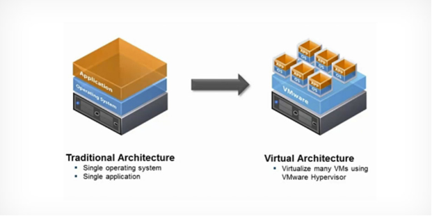

# Virtualization(가상화)

### 1. 가상화 개념

​						

가상화는 소프트웨어를 사용하여 프로세서, 메모리, 스토리지 등과 같은 단일 컴퓨터의 하드웨어 요소를 일반적으로 가상 머신(VM)이라고 하는 다수의 가상 컴퓨터로 분할할 수 있도록 해주는 컴퓨터 하드웨어 상의 추상화 계층을 구축합니다.

> **wikipedia**
>
> 컴퓨터에서 컴퓨터 리소스의 추상화를 일컫는 광범위한 용어이다. "물리적인 컴퓨터 리소스의 특징을 다른 시스템, 응용 프로그램, 최종 사용자들이 리소스와 상호 작용하는 방식으로부터 감추는 기술"로 정의할 수 있다.

곧 가상화란 물리적인(HW)를 논리적 객체로 추상화 하는 것.

위에서 정리해본 내용들을 한 줄로 요약해드리면서 마치겠습니다!

ㅇ 호스트 가상화: 가상화 S/W를 설치하기 위한 OS가 필요한 기술

ㅇ 하이퍼바이저 가상화: 가상화 S/W를 H/W에 바로 설치하는 기술

  \- 전가상화: Guest OS의 수정이 필요 없도록 H/W 전체를 가상화 하는 기술

  \- 전가상화: Guest OS를 수정하여 특정 명령이 수행될 때 Hypercall을 호출하여 하이퍼바이저가 실행되도록 하는 기술

  \- Hypercall: H/W에 접근할 때 사용하는 명령

### 2. 가상화 종류

#### 	2.1 호스트 OS형(Host OS)

호스트OS형은 물리적 하드웨어위에 OS를 설치해, 그 위에 가상화 소프트웨어와 가상머신을 움직이는 방식이다.

즉, 물리 머신위에 직접동작하는 OS를 “Host OS”라한다.(일반 PC) 또한, 이 Host OS위에서 동작하는 가상화 머신에 설치된 O/S를 “Guest OS”라 부른다.

> **SW**
>
> - VMware Workstation
> - Microsoft Virtual PC
> - VirtualBox

#### 2.2 하이퍼바이저 형

 \- 위와 반대로 호스트 OS가 필요 없이 직접 H/W에 설치하여 Guest OS를 구동 시키는 방식 입니다.

 \- 호스트 OS에 H/W의 리소스를 할당할 필요가 없기 때문에 호스트 가상화에 비해 오버헤드가 적은 것이 장점입니다.

 \- 별도의 관리 콘솔이 필요할 수 도 있습니다.

 \- 하이퍼바이저 가상화는 반가상화/전가상화로 더욱 세분화됩니다.

 \- Citrix XenServer, MS hyper-V, KVM 등이 있습니다.

##### 	2.2.1 전가상화

 \- 전가상화는 하드웨어를 완전히 가상화 하는 방식으로 Hardware Virtual Machine 이라고도 불립니다.

 \- 하이퍼바이저 관리용 가상 머신이 실행되며, 모든 가상머신들의 하드웨어 접근이 해당 관리 머신을 통해서 이루어집니다.

 \- GuestOS는 하이퍼바이저의 존재를 알 필요가 없습니다.

 \- **장점:** 하드웨어를 완전히 가상화 하기 때문에 Guest OS의 커널 등의 수정이 필요 없습니다. 특히 Windows부터 Linux까지 다양한 OS를 사용할 수 있는 장점이 있습니다

 \- **단점:** 하이퍼바이저의 관리용 가상 머신이 모든 명령을 중재하고 번역하기 때문에 비교적 성능이 느릴 수 있습니다.

##### 2.2.2 반가상화

 \- 반가상화는 전가상화와 유사한 부분이 많지만 Guest OS는 스스로가 가상 환경임을 인지하고 있습니다.

 \- 전가상화의 성능 저하 문제점을 개선하기 위해 별도의 인터페이스를 통해 명령을 하게 됩니다. 

 \- 위와 같은 명령을 하기 위해선 Guest OS의 일부를 수정해줘야 하는 단점이 있습니다

#### 	2.3 컨테이너형

컨테이너형은 최근 급격히 보급되고 있는 비교적 새로운 타입의 가상화방식이다.

Host OS형과 같이, 물리머신에 설치된 OS위에 가상환경(컨테이너)을 움직이기위해, Host OS형의 한종류로서 분류되기도하나, 컨테이너형의 컨테이너에는 게스트OS나 가상하드웨어를 포함하지 않는다는 점이 호스트OS형과 다른점이다.

컨테이너형 에서는 일반적으로 가상화소프트웨어를 “컨테이너엔진” 혹은 “컨테이너관리 소프트웨어”라고도 부른다.

즉, 컨테이너형은 위 2가지 방식과는 다르게,  “기존 가상머신”이 아닌, “컨테이너”속에 가상화OS가를 제외한, 소프트웨어를 가상화하는것에 특화된 기술로 해석할수있다.

컨테이너형의 가상화소프트웨어는 이하와 같다.

### 2.3 하이퍼바이저(Hypervisor)

### 2.4 가상 머신(Virtual Machine, VM)

### 2.5 컨테이너(Container)

> 참고
>
> https://tinyurl.com/2ovxyms4