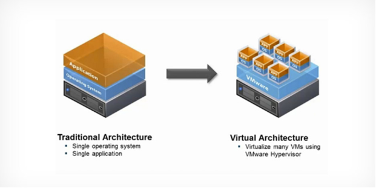
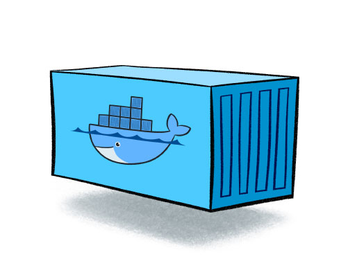
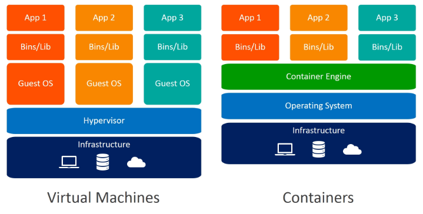

## *1. What is Docker?*

### *1.1 Docker*

Docker는 Docker Inc.에 의해 개발 된 Go 언어로 작성된 소프트웨어이며  **LXC라는 컨테이너 기술**을 기반으로 만들어진 상위레벨의 **오픈소스 가상화 플랫폼**입니다. 

**LXC**기술로 만들어진 Docker는 Linux 커널의 여러 기능을 활용하여 기능을 제공하고, 격리 기술들을 사용해 컨테이너로 실행하고 관리할 수 있습니다.

### *1.2 LXC(Linux Containers)*

*LXC*(Linux Containers)는 단일 컨트롤 호스트 상에서 여러 개의 고립된 리눅스 시스템 (컨테이너)들을 실행하기 위한 운영 시스템 레벨 **가상화** 방법입니다.

> 가상 머신(Virtual Machine, VM)
>
> 가상 머신(Virtual Machine, VM)은 물리적 하드웨어 시스템에 구축되어 자체 CPU, 메모리, 네트워크 인터페이스 및 스토리지를 갖추고 가상 컴퓨터 시스템으로 작동하는 가상 환경입니다.
>
> 가상 머신을 사용하는 이유(장점)
>
> - 가상화를 사용하면 데이터를 분할하고 서비스를 서로 다른 서버에서 격리하여 데이터 보안을 강화할 수 있습니다. 각 가상 머신은 호스트 시스템을 포함한 다른 가상 머신과 격리
>
> - 가상 머신은 유지 및 관리가 간편하며 범용성이 뛰어남
> - 하나의 물리적 컴퓨터에서 여러 운영 체제 환경을 실행할 수 있음
>
> 단점
>
> - 하나의 물리적 시스템에서 여러 가상 머신을 실행하면 성능이 불안정해질 수 있음
> - 가상 머신은 물리적 컴퓨터보다 효율성이 떨어지며 실행 속도도 느림  
>   ex)  *MVC* (Model-View-Controller) Pattern을 구축하여 이를 개발 서버에 배포할 때에는 가상머신을 이용하여 개발 서버를 구축하지만 이를 상용화할 때는 별도에 하트웨어를 구축하여 운영서버를 구축한다.

---

## 2. Virtualization(가상화)

### 2.1 가상화 개념

가상화는 소프트웨어를 사용하여 프로세서, 메모리, 스토리지 등과 같은 단일 컴퓨터의 하드웨어 요소를 일반적으로 가상 머신(VM)이라고 하는 다수의 가상 컴퓨터로 분할할 수 있도록 해주는 컴퓨터 하드웨어 상의 추상화 계층을 구축합니다.

> **wikipedia**
>
> 컴퓨터에서 컴퓨터 리소스의 추상화를 일컫는 광범위한 용어이다. "물리적인 컴퓨터 리소스의 특징을 다른 시스템, 응용 프로그램, 최종 사용자들이 리소스와 상호 작용하는 방식으로부터 감추는 기술"로 정의할 수 있다.

곧 가상화란 물리적인(HW)를 논리적 객체로 추상화 하는 것.

### 2.2 가상화 종류

#### 2.2.1 호스트 OS형(Host OS)

호스트 OS형은 물리적 하트웨어위에 OS를 설치해, 그위에 가상화 소프트웨어와 가상머신(Guest OS)을 움직이는 방식이다.

#### 	2.2.2 하이퍼바이저 형

#### 2.2.3 컨테이너형

#### 2.2.4

### 2.3 하이퍼바이저(Hypervisor)

### 2.4 가상 머신(Virtual Machine, VM)

### 2.5 컨테이너(Container)

> **Hypervisor**
>
> 하이퍼바이저는 가상 머신(Virtual Machine, VM)을 생성하고 구동하는 소프트웨어입니다. 가상 머신 모니터(Virtual Machine Monitor, VMM)라고도 불리는 하이퍼바이저는 하이퍼바이저 운영 체제와 가상 머신의 리소스를 분리해 VM의 생성과 관리를 지원합니다.
>
> 하이퍼바이저로 사용되는 물리 하드웨어를 호스트라고 하며 리소스를 사용하는 여러 VM을 게스트라고 합니다.
>
> 하이퍼바이저는 CPU, 메모리, 스토리지 등의 리소스를 처리하는 풀로, 기존 게스트 간 또는 새로운 가상 머신에 쉽게 재배치할 수 있습니다.

> **가상화와 클라우드 컴퓨팅의 차이는 무엇일까요?**
> 가상화와 클라우드 컴퓨팅 모두 하드웨어에서 리소스를 분리하여 유용한 환경을 생성하므로 이 둘을 흔히 혼동하곤 합니다. 가상화를 통해 클라우드를 생성할 수는 있지만, 그렇다고 해서 이것이 클라우드 컴퓨팅은 아닙니다. 설명하자면 다음과 같습니다.
>
> - 가상화는 하드웨어에서 기능을 분리하는 기술입니다.
> - 클라우드 컴퓨팅은 이러한 분할에 따라 작동하는 솔루션보다 큰 개념입니다.

---

## 3. Docker Container

### Container

컨테이너는 가상화 기술 중 하나로 대표적으로 LXC(Linux Container)가 있습니다. 기존 **<u>OS를 가상화</u>** 시키던 것과 달리 컨테이너는 OS레벨의 가상화로 격리된 공간에서 프로세스가 동작하는 기술입니다.

#### Docker VS VM(Virtual Machine)

|                       | Docker                                                       | Virtual Machines (VMs)                                       |
| --------------------- | ------------------------------------------------------------ | ------------------------------------------------------------ |
| **Boot-Time**         | 몇 초 안에 부팅됩니다.                                       | VM이 부팅되는 데 몇 분 정도 걸립니다.                        |
| **Runs on**           | Docker는 Docker engine을 사용합니다.                         | VM은 하이퍼바이저를 사용합니다.                              |
| **Memory Efficiency** | 가상화에 공간이 필요하지 않으므로 메모리가 적습니다.         | 표면을 시작하기 전에 전체 OS를 로드해야 하므로 효율성이 떨어집니다. |
| **Isolation**         | 격리 시스템에 대한 조항이 없기 때문에 역경에 빠지기 쉽습니다. | 효율적인 격리 메커니즘으로 인해 간섭 가능성이 최소화됩니다.  |
| **배포**              | 컨테이너화된 단일 이미지만 모든 플랫폼에서 사용할 수 있으므로 배포가 쉽습니다. | 별도의 인스턴스가 실행을 담당하므로 배포 시간이 비교적 오래 걸립니다. |
| **Usage**             | Docker has a complex usage mechanism consisting of both third party and docker managed tools. | Tools are e                                                  |
| 리소스 사용량         | 리소스 사용량 감소                                           | 더 많은 리소스 사용량                                        |

> ##### 참고
>
> https://www.docker.com
>
> https://linuxcontainers.org/lxc/introduction/
>
> https://www.redhat.com/en/topics/virtualization