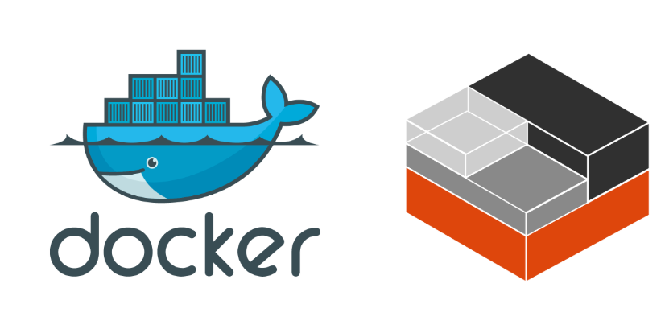
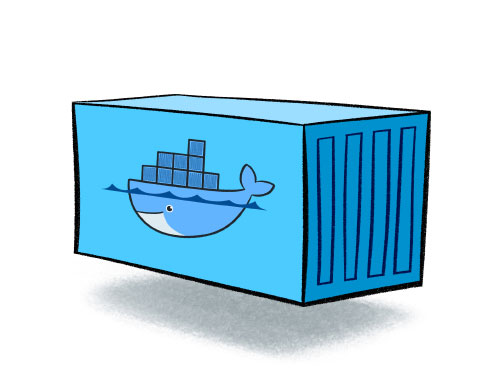

## *1. What is Docker?*

### *Docker*

Docker는 Docker Inc.에 의해 개발 된 Go 언어로 작성된 소프트웨어이며  **LXC라는 컨테이너** 기술을 기반으로 만들어진 상위레벨의 **오픈소스 가상화 플랫폼**(컨테이너 기술)입니다. 

***LXC***기술로 만들어진 Docker는 Linux 커널의 여러 기능을 활용하여 기능을 제공하고, 격리 기술들을 사용해 컨테이너로 실행하고 관리할 수 있습니다.

### *LXC(Linux Containers)*

*LXC*(Linux Containers)는 단일 컨트롤 호스트 상에서 여러 개의 고립된 리눅스 시스템 (컨테이너)들을 실행하기 위한 운영 시스템 레벨 가상화 방법이다.

> 가상 머신(Virtual Machine, VM)
>
> 가상 머신(Virtual Machine, VM)은 물리적 하드웨어 시스템에 구축되어 자체 CPU, 메모리, 네트워크 인터페이스 및 스토리지를 갖추고 가상 컴퓨터 시스템으로 작동하는 가상 환경입니다
>
> 가상 머신을 사용하는 이유(장점)
>
> - 가상화를 사용하면 데이터를 분할하고 서비스를 서로 다른 서버에서 격리하여 데이터 보안을 강화할 수 있습니다. 각 가상 머신은 호스트 시스템을 포함한 다른 가상 머신과 격리됩니다.
>
> - 가상 머신은 유지 및 관리가 간편하며 범용성이 뛰어남
> - 하나의 물리적 컴퓨터에서 여러 운영 체제 환경을 실행할 수 있음
>
> 단점
>
> - 하나의 물리적 시스템에서 여러 가상 머신을 실행하면 성능이 불안정해질 수 있음
> - 가상 머신은 물리적 컴퓨터보다 효율성이 떨어지며 실행 속도도 느림  
>   ex)  *MVC* (Model-View-Controller) Pattern을 구축하여 이를 개발 서버에 배포할 때에는 가상머신을 이용하여 개발 서버를 구축하지만 이를 상용화할 때는 별도에 하트웨어를 구축하여 운영서버를 구축한다.

---

## 2. Docker Container

### Docker Container

컨테이너는 가상화 기술 중 하나로 대표적으로 LXC(Linux Container)가 있습니다. 기존 **<u>OS를 가상화</u>** 시키던 것과 달리 컨테이너는 OS레벨의 가상화로 격리된 공간에서 프로세스가 동작하는 기술입니다.

한 서버의 여러 OS를 가상화 하여 사용하는 것과 컨테이너 방식으로 프로세스를 격리시켜 동작하는 방법은 어떠한 차이점이 있을까요?

## 3. Docker VS VM(Virtual Machine)

> #### 참조
>
> https://www.docker.com
>
> https://linuxcontainers.org/lxc/introduction/